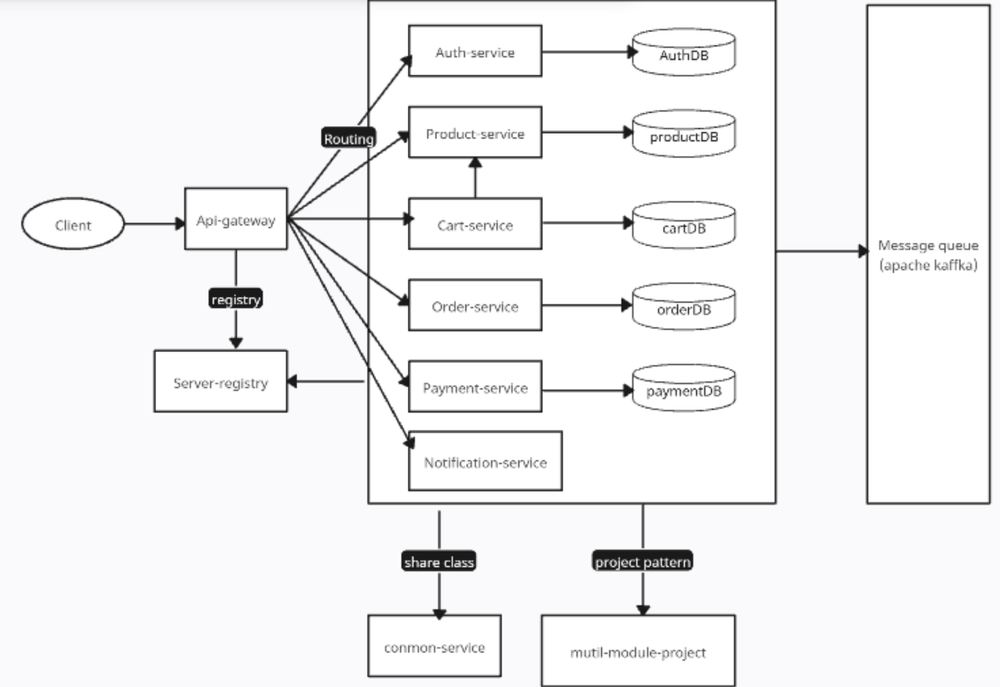
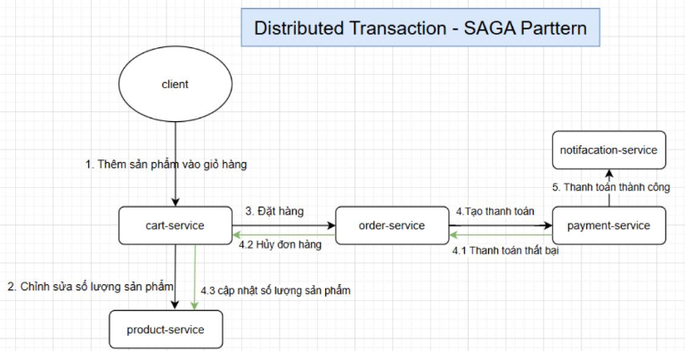

# Web E-commerce - Microservices Architecture

## 📌 Giới thiệu

Đây là dự án E-commerce được xây dựng dựa trên kiến trúc microservices, với nhiều dịch vụ độc lập để xử lý các chức năng khác nhau của hệ thống.

## 🚀 Các dịch vụ

Dự án bao gồm các microservices sau:

- **service-registry**: Quản lý và đăng ký các dịch vụ trong hệ thống
- **api-gateway**: Routing services, load balancing, retry requests, limit request rate, authentication
- **common-service**: Chia sẻ các class, functions chung của các services
- **multi-module-project**: Cấu hình chung version, dependencies ,plugins cho các services
- **config-server**: Cấu hình tập trung(apptication.properties) cho các services
- **auth-service**: JWT authentication and authorization
- **user-service**: Quản lý người dùng
- **product-service**: Quản lý sản phẩm
- **cart-service**: Quản lý giỏ hàng
- **order-service**: Xử lý đơn hàng
- **payment-service**: Xử lý thanh toán đơn hàng (tiền mặt, vnpay)
- **notification-service**: Gửi thông báo về email sau khi đặt hàng
- **ai-chatbox**: Hỗ trợ chat tự động

## 🛠️ Công nghệ sử dụng
- **Build tool**: maven >= 3.9.5
- **Java**: 21
- **Framework**: Spring boot 3.2.x
- **DBMS**: MySQL , Mariadb
- **Spring Boot**
- **Spring Data JPA**
- **Spring Security - JWT**
- **Spring Cloud**
- **Docker, Docker Swarm**
- **Apache Kafka**
- **Redis**

## 🔧 Cài đặt và Chạy

### Sử dụng Docker Compose

```bash
docker-compose up -d
```

### Sử dụng Docker Swarm

```bash
./scripts/deploy-swarm.sh
```

## 🔍 Kiến trúc hệ thống

## Mô hình quy trình thanh toán của hệ thống (Apache Kafka,OpenFeign)

